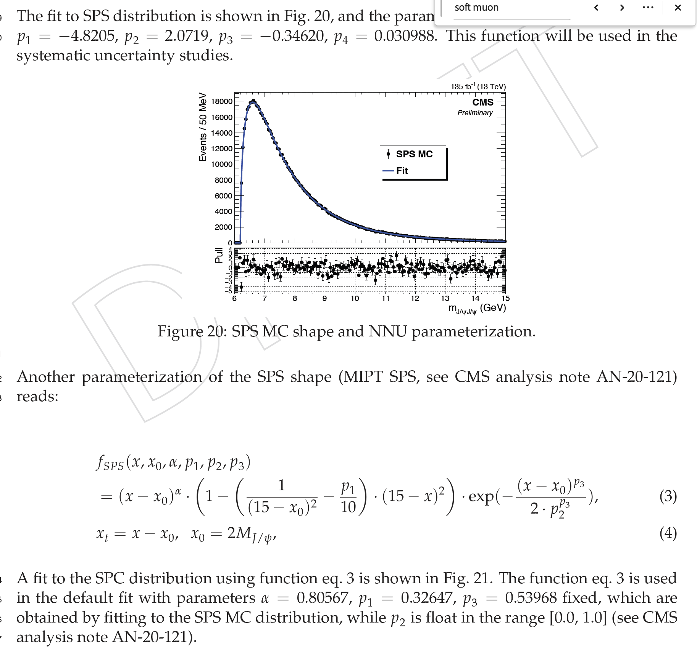
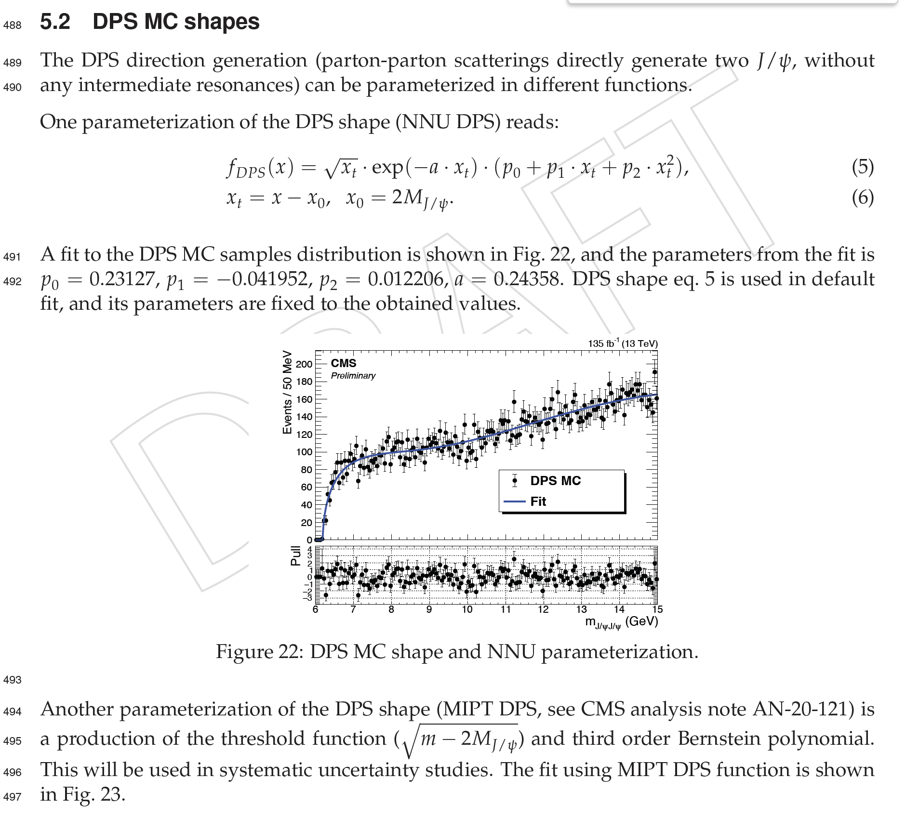

> ## Goal of this exercise
> The goal of this exercise is to **find structures in the JpsiJpsi spectrum and evaluate their significance**.
> `mJJDataFull6000_15000.txt` was created in Exercise 1 with a small amount of data, so the events in this file are not enough for a good fit. We have prepared [a file containing all the full Run2 available statistics](https://github.com/IreneZoi/DAS2024JpsiJpsi/blob/exercise/fullrun2data/mJJDataFull6000_15000.txt) that will be used for the next fit step.
{: .checklist}

## Fit setup
~~~
cd ~/nobackup/CMSDAS2024JpsiJpsi/CMSSW_11_1_1/src/
cmsenv
cd ../../fitpackage/
# Then you need to compile the pre-defined fit functions
source makeLibSo.sh

# you should see this output:
Processing BlattWeisskopfQ2.cxx+...
Info in <TUnixSystem::ACLiC>: creating shared library /uscms_data/d3/lchen/cmsdas2024/CMSSW_11_1_1/src/fitpackage/./BlattWeisskopfQ2_cxx.so

Processing ComplexRelBWFcn.cxx+...
Info in <TUnixSystem::ACLiC>: creating shared library /uscms_data/d3/lchen/cmsdas2024/CMSSW_11_1_1/src/fitpackage/./ComplexRelBWFcn_cxx.so

Processing MyRelBWSquare.cxx+...
(MyRelBWSquare) An instance of MyRelBWSquare.

......
~~~
{: .language-bash}

## The background fit

We have prepared two files for you, [`null.C`](https://github.com/IreneZoi/DAS2024JpsiJpsi/blob/exercise/fitpackage/null.C) and [`null_BW0.C`](https://github.com/IreneZoi/DAS2024JpsiJpsi/blob/exercise/fitpackage/null_BW0.C). 

In `null.C`, only the probability distribution functions of the two backgrounds, SPS (single-parton scattering) and DPS (double-parton scattering), are used to fit the data, while `null_BW0.C` considers also one structure peak described by a Breit-Wigner. This will be described in the next section. For now let's focus on the backgrounds.

> ## More on the backgrounds...
> 
> 
{: .solution}

> ## Task 1
> Open the [`null.C`](https://github.com/IreneZoi/DAS2024JpsiJpsi/blob/exercise/fitpackage/null.C) code and understand the different parts. The comments in the code should help you identify:
> - Where the background functions are defined
> - How is the final fit function (pdf built)
> - Where the fit to the data happens
> - How to plot the fit results
{: .challenge}

Now you can run `null.C`:
~~~
root -l null.C 
~~~
{: .language-bash}

It will take a few minutes to run the code and it will produce a long printout on the screen. The important informations are summarized at the end and the plot will be stored in `figure/fit_null.pdf`.

> ## Your fit should look like this
> 
{: .solution}

> ## Questions 
> - Is it a good fit? 
> - What is the value of the log-Likelihood of the fit? 
> - How many free parameters are in the fit?
{: .challenge}

> ## Tip
> remember the *"FCN value"*! We will call it `FCN_null` later.
{: .callout}

## The signal fit

How can we improve the fit? We have prepared a script, [`null_BW0.C`](https://github.com/IreneZoi/DAS2024JpsiJpsi/blob/exercise/fitpackage/null_BW0.C) ,in which we also added a Breit-Wigner (BW) function to describe the peak at the lowest edge of the mass distribution. This is very similar to the script with only the background fit so you should be able to locate the same parts as before.

Here is the formula of the BW function:

The BW function is often used to model resonances (unstable particles) in high-energy physics.
The most important parameters are:
- The mass `m_0` (i.e. the peak position) 
- The width of the peak `Gamma`

> ## Task 2
> Compare this formula with the code implementation.
> - Can you find where the BW is defined?
> - What is the initial fit value assigned to the mass and the width?
> - Which parameters are fixed and which are left floating during the fit?
{: .challenge}

Now you can run `null_BW0.C`:
~~~
root -l null_BW0.C 
~~~
{: .language-bash}

Also in this case it will take a few minutes to run the code and it will produce a long printout on the screen. The important informations are summarized at the end and the plot will be stored in `figure/fit_null_BW0.pdf`.

> ## Your fit should look like this
> 
{: .solution}

> ## Questions 
> - Has the fit improved? 
> - What is the value of the log-Likelihood of the fit? 
> - How many free parameters are in the fit?
{: .challenge}

> ## Task 3
> To have an easier calculation of the peak significance later we suggest repeating the fit fixing the value of the peak mass and width. How many free parameters are now in the fit?
{: .challenge}

> ## Tip
> remember the *"FCN value"*! We will call it `FCN_BW0` later.
{: .callout}

## The peak significance calculation
For semplicity, we will evaluate the local significance of the peak without systematic uncertainties. We use the null hypothesis and signal hypohtesis to fit the data. From each of them we obtained the log-Likelihood `−lnL` (NLL). We called them `FCN_null` and `FCN_BW0` earlier as that is the nomenclature used by the `RooFit` tool used for the fit. Using the difference `∆NLL = FCN_null - FCN_BW0` and considering the fact that the difference in degrees of freedom is 1, we can evaluate the significance of BW0 as `sqrt(2*∆NLL)`.

> ## Questions
> What do you obtain for the significance?
{: .challenge}

## Finding all the structures
There are still a few peaks in the plots that have not been identified. 

> ## Task 4
> Try to fit all the peaks adding the corresponding BW in the code. Use the implementation of the BW0 as an example. 
{: .challenge}

Below we provide some hints on how to do it for one of the peaks.

> ## Define the fit parameters
> ~~~
> double massX6500Init = 6.55258e+00, massX6500Min = 6.40, massX6500Max = 6.80;
> RooRealVar massX6500("massX6500", "massX6500", massX6500Init, massX6500Min, massX6500Max);
> massX6500.setConstant(kFALSE);
> double widthX6500Init = 1.24095e-01, widthX6500Min = 0.00, widthX6500Max = 0.50;
> RooRealVar widthX6500("widthX6500", "widthX6500", widthX6500Init, widthX6500Min, widthX6500Max);
> widthX6500.setConstant(kFALSE);
> double LX6500Init = 0;
> RooRealVar LX6500("LX6500", "LX6500", LX6500Init);
> LX6500.setConstant(kTRUE);
> double dX6500Init = 3.00, dX6500Min = 1.00, dX6500Max = 5.00;
> RooRealVar dX6500("dX6500", "dX6500", dX6500Init, dX6500Min, dX6500Max);
> dX6500.setConstant(kTRUE);
> double coefX6500Init = 1, coefX6500Min = 0, coefX6500Max = 1000;
> RooRealVar coefX6500("coefX6500", "coefX6500", coefX6500Init, coefX6500Min, coefX6500Max);
> coefX6500.setConstant(kTRUE);
> double phiX6500Init = 0, phiX6500Min = -PI, phiX6500Max = PI;
> RooRealVar phiX6500("phiX6500", "phiX6500", phiX6500Init, phiX6500Min, phiX6500Max);
> phiX6500.setConstant(kTRUE);
> ~~~
> {: language-cpp}
{: .solution}

> ## Build the BW
> ~~~
> MyRelBWSquare X6500("X6500", "X6500", mx, massX6500, widthX6500, LX6500, dX6500, coefX6500, phiX6500);
> ~~~
> {: language-cpp}
{: .solution}

> ## Include the normalization term
> ~~~
> double numX6500Init = 4.70494e+02, numX6500Min = 0, numX6500Max = 10000;
> RooRealVar numX6500("numX6500", "numX6500", numX6500Init, numX6500Min, numX6500Max);
> numX6500.setConstant(kFALSE);
> ~~~
> {: language-cpp}
{: .solution}

> ## Build the smearing function
> ~~~
> MiptDoubleGaussian2 resoX6500("resoX6500", "resoX6500", mx, R_ZERO, frac_g2, massX6500, R_MTH, w_g1, w_g2, beta);
> ~~~
> {: language-cpp}
{: .solution}

> ## Make the convolution of the BW and the smearing function
> ~~~
> RooFFTConvPdf X6500Reso("X6500Reso", "X6500Reso", mx, X6500, resoX6500);
> ~~~
> {: language-cpp}
{: .solution}

> ## Build the model 
> ~~~
> RooArgList pdfList(dpsPdf, spsPdf, Th1Reso, X6500Reso);
> RooArgList numList(numDps, numSps, numTh1, numX6500);
> ~~~
> {: language-cpp}
{: .solution}

> ## Plot the fit result
> ~~~
> model.plotOn(frame, Components(X6500Reso), Name("X6500"), LineColor(kRed), LineStyle(kDotted));
> leg.AddEntry(frame->findObject("X6500"), "BW1", "l");
> ~~~
> {: language-cpp}
{: .solution}

> ## The final fit should look like this
> 
{: .solution}

> ## Next
> **It is not over! Go to the next <a href="../03-ThinkingDeeper/index.html">exercise</a> to discuss your findings.**
{: .callout}

